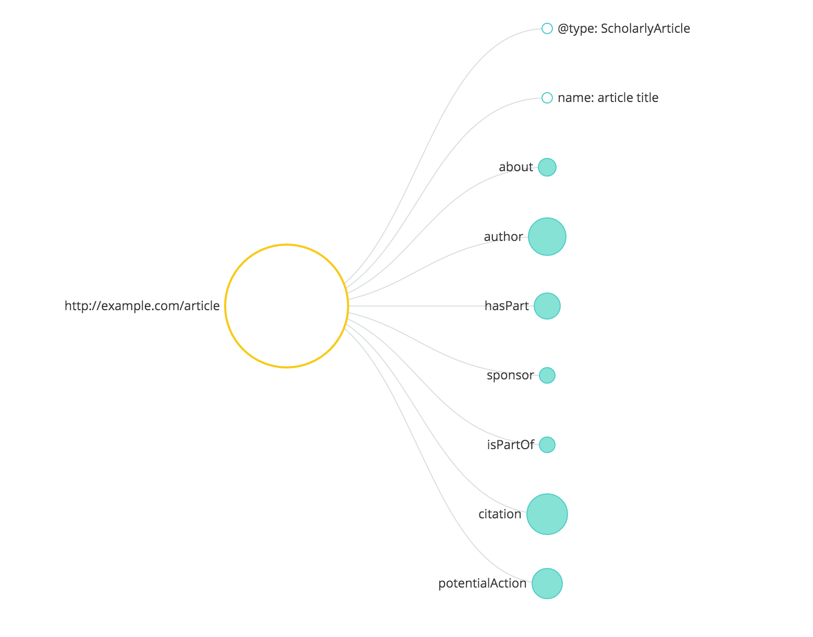
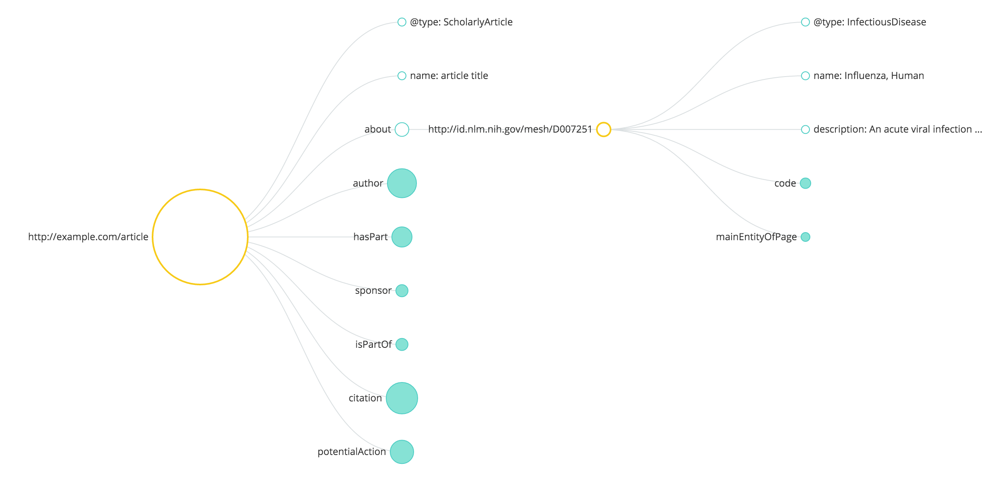
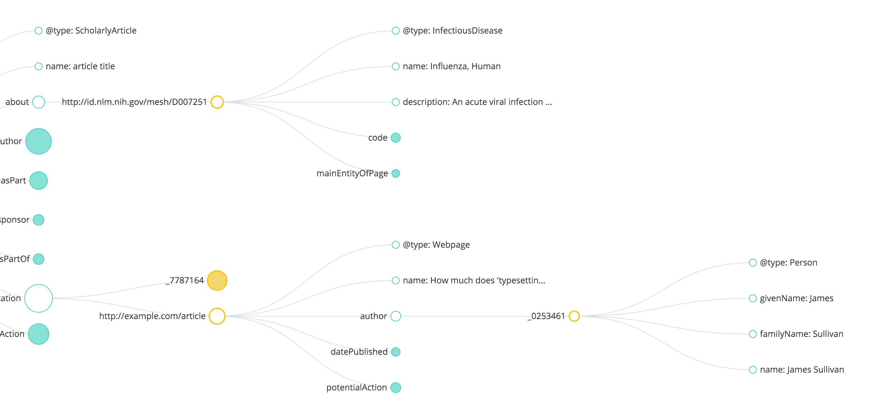
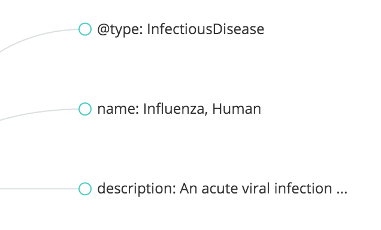

# JSON-LD visualization

Turn JSON-LD into pretty graphs. See the
**[online example](https://scienceai.github.io/jsonld-vis)**.







### Usage

See the `examples/` folder for usage details.

Import `jsonld-vis.js` and `jsonld-vis.css`. The CSS may look better if 'Open Sans' is available as
a font (but it will work without it).

To initialize, simply load data into the exported `jsonldVis` function:

```js
import d3 from 'd3';
import jsonldVis from 'jsonld-vis';
jsonldVis(d3);

d3.json('example.json', (err, data) => {
  if (err) return console.warn(err);
  d3.jsonldVis(data, '#graph', { w: 800, h: 600, maxLabelWidth: 250 });
});
```

#### `d3.jsonldVis(data, querySelector[, config])`

Where the optional `config` variable is as follows:

```js
{
  h: 600, // height
  w: 800, // width
  maxLabelWidth: 250, // maximum label width
  transitionDuration: 750, // transition duration, in ms
  transitionEase: 'cubic-in-out', // transition easing function
  minRadius: 5 // minimum node radius
  scalingFactor: 2 // factor to scale node sizes
}
```

Specifying the width is just for initialization purposes. The width of the svg element will
dynamically be adjusted as necessary. For horizontal auto-scrolling, the specified `querySelector`
must have horizontal scroll enabled:

```css
query-selector {
  overflow-x: autho;
}
```

For large data, it may be necessary to adjust the scaling so that node sizes still look reasonable.
The `scalingFactor` allows adjustment of this - larger values of `scalingFactor` will reduce the
maximum node size.

Labels that are longer than maximum label width are truncated; hover over the node to see the full
label:




### License

[Apache 2.0](https://github.com/scienceai/jsonld-vis/blob/master/LICENSE)
